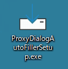
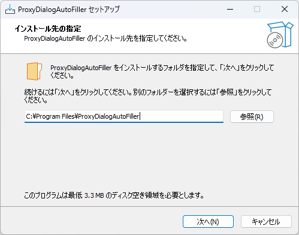
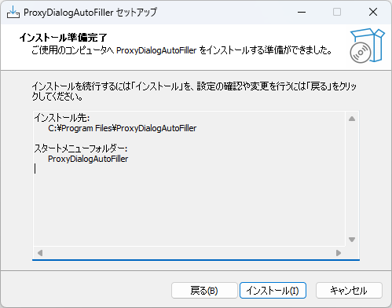
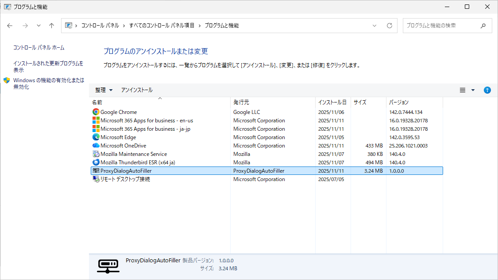
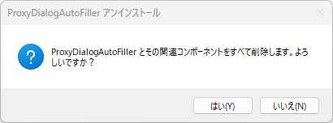
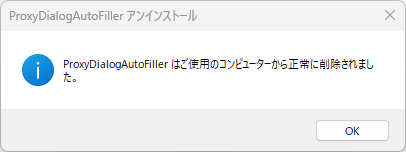
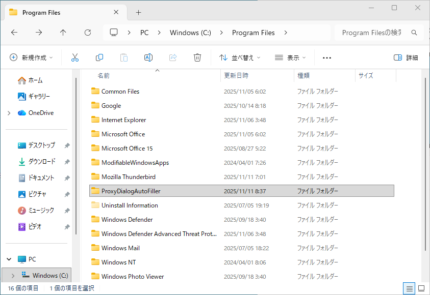
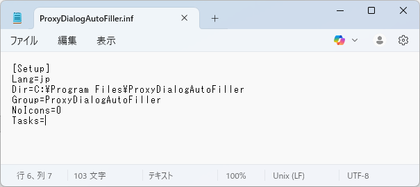
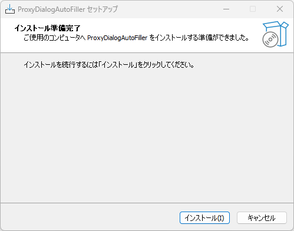
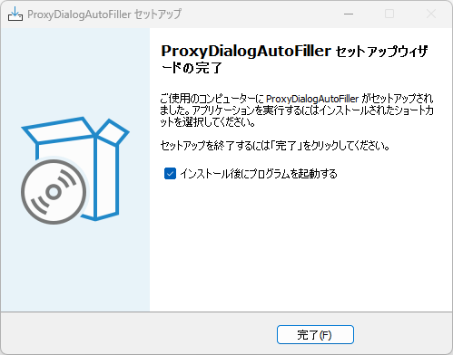

更新履歴

| 日付       | Version | 備考                              |
|------------|---------|-----------------------------------|
| 2025/11/14 | 1.0.0    | 第1版                             |

**本書について**

本書は、株式会社クリアコードが、ProxyDialogAutoFillerを御利用いただく管理者向けに作成した資料となります。2025年11月時点のデータにより作成されており、それ以降の状況の変動によっては、本書の内容と事実が異なる場合があります。また、本書の内容に基づく運用結果については責任を負いかねますので、予めご了承下さい。

本書で使用するシステム名、製品名は、それぞれの各社の商標、または登録商標です。なお、本文中ではTM、®、©マークは省略しています。

\newpage
# ProxyDialogAutoFiller概要

## ProxyDialogAutoFillerとは

Google ChromeおよびMicrosoft Edgeでプロキシのユーザー認証ダイアログが表示されたとき、自動でユーザー名およびパスワードを入力するソリューションです。

\newpage
# システム要件

## 概要

ProxyDialogAutoFillerが対応しているWindowsシステムについて、記述します。

## 動作サポートOS

**クライアント系OS**

- **Windows 11**
- **Windows 10**

## 動作サポート ブラウザー

- **Microsoft Edge (最新版)**
- **Google Chrome（最新版）**

\newpage
# インストール手順

## ProxyDialogAutoFillerインストールについて

ProxyDialogAutoFillerを利用するために、別途ランタイムライブラリー(.NET Framework等)の追加インストールは必要ありません。

## インストール方法

以下のインストーラーを使用しインストールします。

* **ProxyDialogAutoFillerSetup.exe**

### Windows 11環境のセットアップ例

1. ProxyDialogAutoFillerSetup.exeを実行します。

     
   
   **■管理者権限で実行してください。**

2. 「次へ」ボタンをクリックします。

     
    
   ■インストール先を変更する場合は、「参照」ボタンよりインストール先を変更します。

3. 「次へ」ボタンをクリックします。

   
    
   ■フォルダーを変更する場合は、「参照」ボタンよりフォルダーを変更します。

4. 「インストール」ボタンをクリックします。

   

5. 「完了」ボタンをクリックします。

   

   ■「インストール後にプログラムを起動する」にチェックをすると、「完了」ボタンクリック後に`ProxyDialogAutoFiller.exe`が実行されます。


以上で、インストール作業は完了です。

インストーラーの実行が完了すると、スタートアッププログラムに`ProxyDialogAutoFiller.exe`が登録されます。
端末の再起動やログオンユーザーのサインアウト/サインインをすると、`ProxyDialogAutoFiller.exe`が自動で起動するようになります。

\newpage
# アンインストール手順

## アンインストール方法 

1. コントロールパネルより「プログラムと機能」を表示します。  

    **■管理者権限で実行してください。**

    

2. 一覧より「ProxyDialogAutoFiller」を選択しダブルクリックします。

    

3. 「はい」ボタンをクリックします。

    

4. アンインストールが完了するとメッセージが表示されます。  

    [OK]をクリックします。

    

5. `<インストール先>\ProxyDialogAutoFiller`フォルダーを削除します。

    

以上で、アンインストールは完了です。

\newpage
# サイレント インストール手順（自動インストール）

## ProxyDialogAutoFillerサイレント インストールについて

ProxyDialogAutoFillerのインストールをサイレント実行するための手順について記載します。

1.  応答ファイルの作成  

    **■デフォルト値でのサイレントインストールの場合は応答ファイルの作成は不要です。**

2.  サイレント インストールによるSetupの実行.

    **■管理者権限での実行が必要です。**

## 応答ファイルの作成

1. メモ帳を起動し`ProxyDialogAutoFiller.inf`ファイルを作成します。

    

2. メモ帳に設定値を記述します。  

    インストール先とスタートメニューフォルダー名がカスタマイズ可能です。

    * インストール先: Dir
    * スタートメニューフォルダー名: Group

    ```
    [Setup]
    Lang=jp
    Dir=C:\Program Files\ProxyDialogAutoFiller
    Group=ProxyDialogAutoFiller
    NoIcons=0
    Tasks=
    ```

## サイレント インストール

### デフォルト値でのサイレント インストールの場合

**■デフォルト値でのサイレントインストールの場合は応答ファイルの作成は不要です。**

1. セットアップ用のEXEファイルに「/SP- /VERYSILENT」オプションを付与し実行します。  
  
    例) ProxyDialogAutoFillerSetup.exe /SP- /VERYSILENT

サイレントインストール完了後、`ProxyDialogAutoFiller.exe`が自動で起動します。

### 応答ファイルを利用したサイレント インストールの場合

1. セットアップ用のEXEファイルに「/SP- /VERYSILENT **/LOADINF="ProxyDialogAutoFiller.inf"**」オプションを付与し実行します。  

    例) ProxyDialogAutoFillerSetup.exe /SP- /VERYSILENT /LOADINF="ProxyDialogAutoFiller.inf"

    ■応答ファイル ProxyDialogAutoFiller.infはSetupファイルと同一フォルダーに設置するかフルパスを指定します。

サイレントインストール完了後、`ProxyDialogAutoFiller.exe`は自動で起動します。

\newpage
# サイレント アンインストール手順（自動アンインストール）

## ProxyDialogAutoFillerサイレント アンインストールについて

ProxyDialogAutoFillerのアンインストールをサイレント実行するための手順について記載します。

**■管理者権限での実行が必要です。**  

**ログ関連のフォルダーや設定ファイル関連はアンインストール後に削除されません。**

## サイレント アンインストール

1. ProxyDialogAutoFillerセットアップ先にあるunins000.exeファイルに「/VERYSILENT」オプションを付与し実行します。  

    例) `"C:\Program Files\ProxyDialogAutoFiller\unins000.exe" /VERYSILENT`

\newpage
# バージョンアップ手順

## ProxyDialogAutoFillerバージョンアップについて

ProxyDialogAutoFillerのアンインストールの必要はありません。上書きインストールを行ってください。  

## バージョンアップ方法

### Windows 11環境のセットアップ例

1. ProxyDialogAutoFillerSetup.exeを実行します。  

   **■管理者権限で実行してください。**

   

2. 「インストール」ボタンをクリックします。

   

3. 「完了」ボタンをクリックします。

   

   ■ 「インストール後にプログラムを起動する」にチェックをすると、「完了」ボタンクリック後に`ProxyDialogAutoFiller.exe`が実行されます。

   ■チェックをしない場合、`ProxyDialogAutoFiller.exe`を起動させるために、端末の再起動かログオンユーザーのサインアウト/サインインが必要です。

以上で、バージョンアップ作業は完了です。

\newpage
# モジュール構成

## ProxyDialogAutoFillerモジュール構成

ProxyDialogAutoFiller インストーラーには以下のモジュールが含まれています。(合計 約40KB)

--------------------------------------------------------------------------------------
ファイル名                            サイズ           概要
------------------------------------- ---------------- --------------------------------
ProxyDialogAutoFiller.exe             約40KB           プロキシダイアログ自動入力ツール
--------------------------------------------------------------------------------------

# 設定概要

ProxyDialogAutoFillerは設定ファイルにより動作を変更することができます。

## 設定ファイルの場所

ProxyDialogAutoFillerセットアップ先のProxySetting.iniファイル

例) `C:\Program Files\ProxyDialogAutoFiller\ProxySetting.ini`

## 設定ファイルの書式

設定ファイルは、以下のように指定します。

```
[localhost]
UserName=test-user
Password=test
```

`[]`でくくられた部分をセクションと呼びます。セクションにはプロキシのホスト名を指定します。
セクションの後に必要なパラメータを指定します。セクション複数指定可能で、セクションごとにパラメータを設定可能です。
つまり、プロキシのホスト名ごとにパラメータが設定可能です。


また、先頭に`#`をつけることで、行をコメントアウトすることができます。

## セクションごとの設定項目の一覧

各セクション（各プロキシのホスト名）では、以下のパラメータを指定可能です。

| 項目                       | 設定内容                               | 既定  |
|----------------------------|---------------------------------------|------|
| UserName                   | プロキシのユーザー名                    | なし |
| Password                   | プロキシのパスワード                    | なし |

#### UserName

プロキシのユーザー名を指定します。
以下のように`=`で値を指定します。

```
UserName=test-user
```

この例の場合、ユーザー名に「`test-user`」を指定しています。

### Password

プロキシのパスワードを指定します。
以下のように`=`で値を指定します。値は平文で指定します。

**パスワードを平文で指定するため、本ファイルの管理には十分気を付けてください**

```
Password=test
```

この例の場合、パスワードに「`test`」を指定しています。

## 例

```
[localhost]
UserName=test-user
Password=test
[example]
UserName=example-user
Password=example
```

これは、ホスト名が「`localhost`」であるプロキシにはユーザー名「`test-user`」、パスワード「`test`」でログインし、
ホスト名が「`example`」であるプロキシにはユーザー名「`example-user`」、パスワード「`example`」でログインする、
という設定です。

## グループポリシー(GPO)を利用した設定ファイルの配布手順

ADに所属している端末の設定を強制する場合、グループポリシー(GPO)で設定ファイルを配布することで強制します。

### 前提

本項目の作業手順は以下の作業環境で実施することを想定します。

* 作業者：システム管理者 1名
* 作業環境：Active Directoryドメインコントローラーを操作可能な Windows 端末 1台
* 適用時に必要なサーバー：全端末からアクセス可能なファイル配布用サーバー 1台

### GPOによる「ProxySetting.ini」の書き換え

以下の作業はすべて、作業環境にて、システム管理者が管理者ユーザーアカウントで実施します。

1. 各端末からアクセス可能なファイル配布用サーバー上に、一般ユーザー権限で読み取り可能な、ファイル配布用フォルダーを作成します。  
以下、コンピューター名/ホスト名が「fileserver」である Windowsファイル共有サーバーを使用し、ファイル配布用フォルダー名は「proxy-dialog-auto-filler」を使用するものと仮定します。  
この仮定に従い、ファイル共有サーバー上に作成された共有フォルダーのUNCパスが「`\\fileserver\proxy-dialog-auto-filler\`」 となると仮定します。
2. 強制したい設定がされた ProxySetting.ini ファイルを作成します。
3. 作成したファイルを、1で作成したファイル配布用フォルダーにコピーします。
前述の仮定に従い、ファイルの UNC パスは  
「`\\fileserver\proxy-dialog-auto-filler\ProxySetting.ini`」  
となると仮定します。
4. 配置した各ファイルの「プロパティ」を開き、「セキュリティ」タブを選択して、当該ファイルが「Everyone」で読み取り可能な状態になっていることを確認します。  
もしそのようになっていない場合は、「編集」ボタンをクリックし、開かれたダイアログ内で「追加」ボタンをクリックして、開かれたダイアログ内で「選択するオブジェクト名を入力してください」欄に「Everyone」と入力し、「OK」ボタンを押してダイアログを閉じる操作を3回繰り返して、ファイルを「Everyone」で読み取り可能な状態に設定します。
5. 任意のADドメイン参加端末に一般ユーザーでログインし、3で配置したファイルを読み取れることを確認します。
  * ProxySetting.ini（前述の仮定に従うと「`\\fileserver\proxy-dialog-auto-filler\ProxySetting.ini`」）をメモ帳などで開き、内容を閲覧できることを確認します。
6. ドメインコントローラーのグループポリシー管理コンソールで、対象の端末の一般ユーザーに適用されるGPOについて、 
「ユーザーの構成」  
→「基本設定」  
→「Windows の設定」  
→「ファイル」  
を右クリックし「新規作成」から「ファイル」を選択します。
7. 以下の通り設定します。
  * アクション：「置換」を選択。
  * ソースファイル：3 で配置した「ProxySetting.ini」を、全端末から参照可能な UNCパスで指定。（例：「`\\fileserver\proxy-dialog-auto-filler\ProxySetting.ini`」）
  * ターゲットファイル：「`C:\Program Files\ProxyDialogAutoFiller\ProxySetting.ini`」を指定。
  * 属性：「読み取り専用」のみにチェック。

以上の手順により、組織内サーバーに設置した`ProxySetting.ini`が、各端末に導入されます。

# プロキシのユーザー認証ダイアログの自動入力動作確認

## 端末準備

1. 使用する端末にプロキシの設定を行います。
2. ログオンユーザーのサインアウト/サインインを行います。
  * これは、スタートアッププログラムで起動する`ProxyDialogAutoFiller.exe`を動作させるための対処です。

## Microsoft Edgeでの確認

1. Microsoft Edgeを起動します。
2. プロキシを経由する必要があるサイトへアクセスします。
3. プロキシのユーザー認証ダイアログに、設定ファイルで指定したユーザー名とパスワードが自動入力され、サインインボタンが押されること確認します。

## Google Chromeでの確認

1. Google Chromeを起動します。
2. プロキシを経由する必要があるサイトへアクセスします。
3. プロキシのユーザー認証ダイアログに、設定ファイルで指定したユーザー名とパスワードが自動入力され、ログインボタンが押されること確認します。
